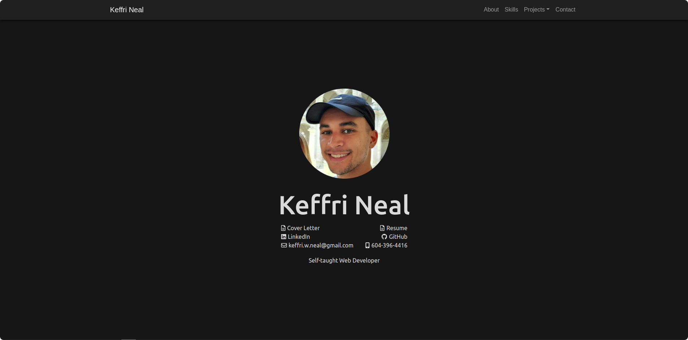

<h1>Keffri Neal - Personal Portfolio Project</h1>

This portfolio is being developed to showcase the technologies that I have learned as well as the ones I am currently learning. This page was developed with the following front-end technologies: HTML, CSS, JavaScript, Sass and Bootstrap.

There are several other practices that I am incorporating into this page while it is under development.

<ul>
    <li>Semantic HTML Elements - Content is clearly defined allowing for better SEO, readability and accessibility.</li>
    <li>Responsive - Built to be responsive on any device that is being used to view the web page. </li>
    <li>BEM CSS Methodology - Organizing and streamlining my CSS class names allows for more efficient coding, better readability and easier integration for other developers.</li>
    <li>Dark Mode - Reduces amount of light emitted by screens. Contrasting light and dark colors for better visual experience. Reduces eye strain on users. Conserves battery power.</li>
</ul>

    

## Author

👤 **Keffri Neal**

- Github: [@keffri](https://github.com/keffri)
- LinkedIn: [Keffri Neal](https://www.linkedin.com/in/keffri/)
- Twitter: [@keffri](https://twitter.com/keffri)
